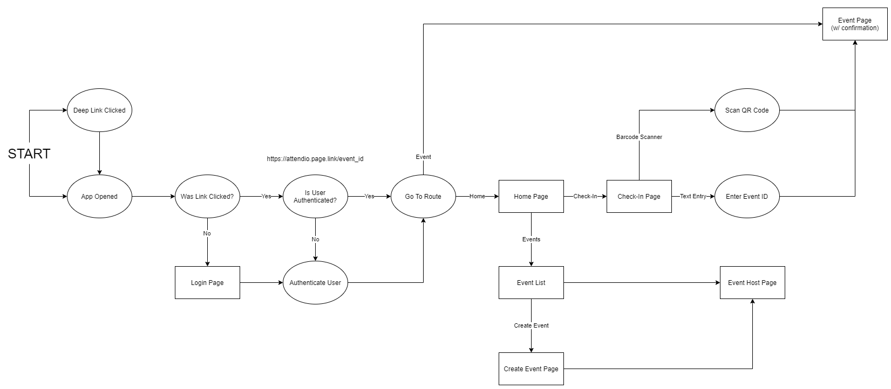

# Attendio: Attendance tracking for events made simple

## Team Members: Benjamin Greenberg, Spencer Howell, Tucker Miles, Vicki Tang, Daniel Troutman

### Figma Designs:
- Web: https://www.figma.com/file/d5dzcoOqKwTbZB6ylPdaFw/Attendio-Design?node-id=9%3A0
- Mobile: https://www.figma.com/file/d5dzcoOqKwTbZB6ylPdaFw/Attendio-Design?node-id=8%3A6102

### How to build and run web project

```flutter run -d chrome --web-hostname localhost --web-port 5000```

### Flow Diagram

<p>

</p>

### Preliminary Design Report

[Document](https://github.com/attendio/attendio/blob/main/Docs/Preliminary%20Design%20Report%20-%20Team%204.pdf)

### MVP Sketches

[Document](https://github.com/attendio/attendio/blob/main/Docs/attendio-mvp-design-sketch.pdf)

### Guidelines for Migrating to new Material Buttons

[Document](https://github.com/attendio/attendio/blob/main/Docs/Migrating_to_the_New_Material_Buttons_and_their_Themes.pdf)

